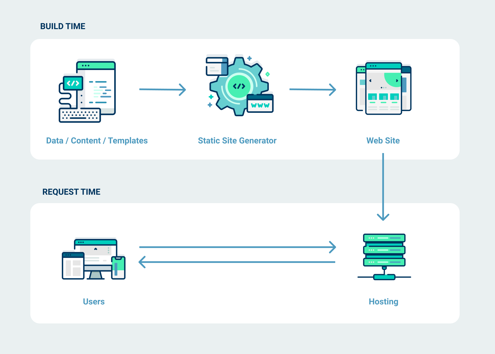
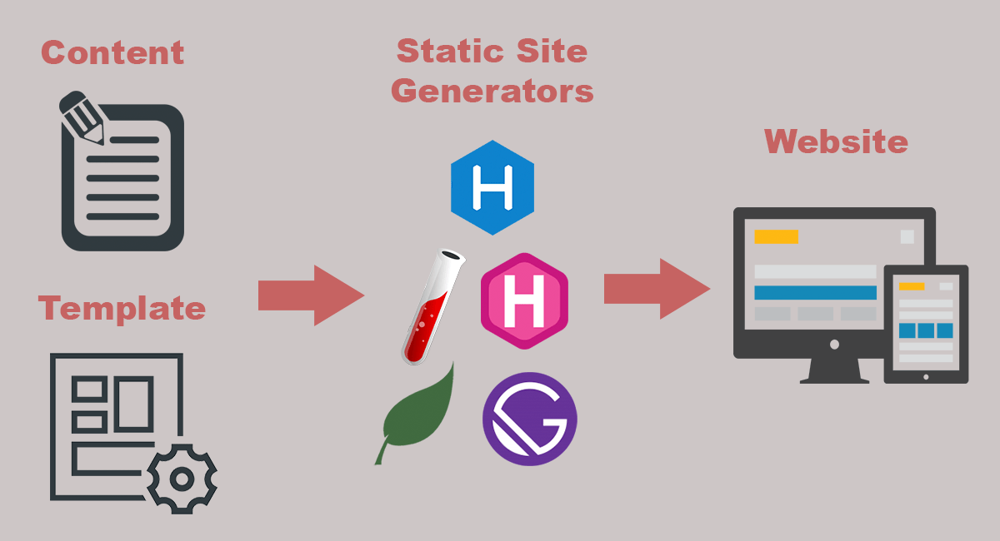
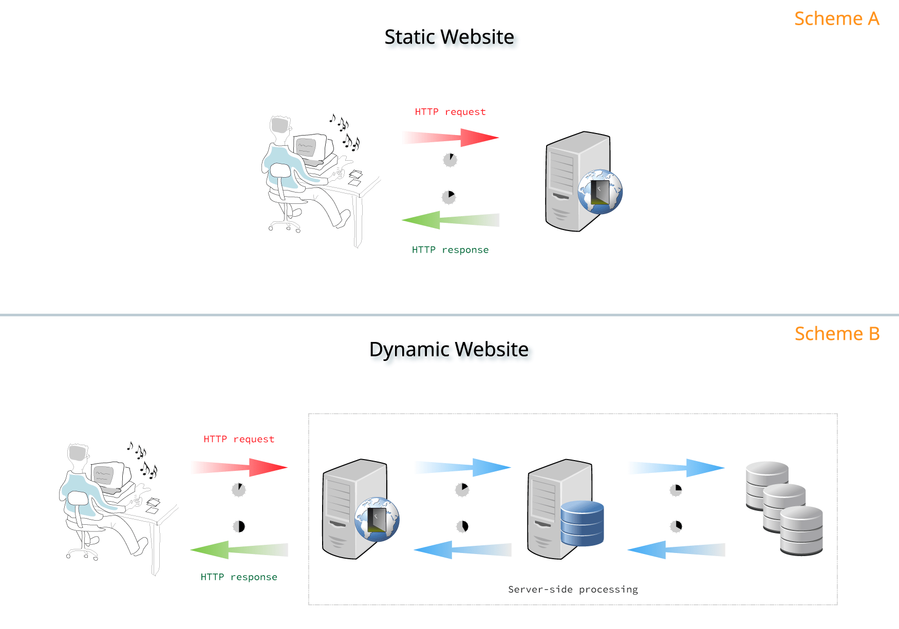
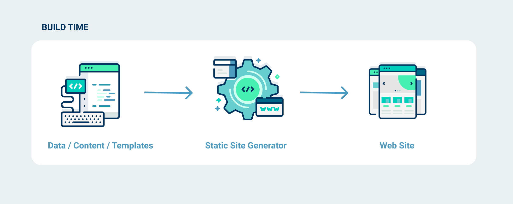
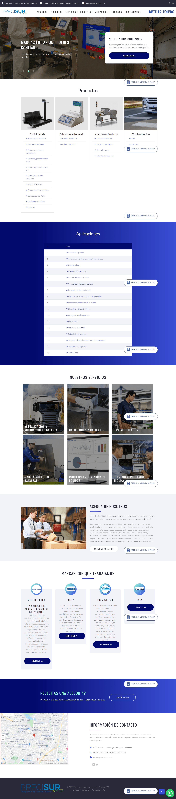

# Xavier Static CMS ver 1.x
Asp.net Combined CMS and Static Website Generator

Think of a static site generator as a script which takes in data, content and templates, processes them, and outputs a folder full of all the resultant pages and assets.

 

---
Published: Feb 14, 2020 by Tariq Hawis:

 

Back in the day, people had no concern about having a secure website. It was not until security flaws in the websites become frequent and the largest companies in the world had reported with millions of account breaches.

Today, almost every website owner is aware of web attacks and the existence of hackers as threat of their websites.

Biggest data breaches in 21st century

So what caused all this chaos?
If you dig down to the details of these enormous breaches, you will find that it started with an injection vulnerability, one of the most common web vulnerabilities that used is SQL Injection which allow the intruder to reach website’s database to extract the stored data, like users’ accounts.

This repeated web incidents have made a bad reputation to the dynamic websites, but then it raised the need to alternative techniques, and here when Static Sites Generators come from.

What is Static Sites Generators
SSGs are a new, hybrid approach to web development that allow you to build a powerful, server-based website locally on your computer but pre-builds the site into static files for deployment.

This modern approach has become the best alternative to dynamic website that has all sorts of programming variables, functions, classes, database calls that increase the potential vulnerabilities in your website.

Dynamic Vs Static Websites (source: gitlab)

This difference is giving the static websites many advantages over the dynamic ones, in terms of security, speed, cost, and scalability.

1. Security

Unlike dynamic websites, there is no data inputs need to be validated, or database calls, so no way for command injections.

2. Speed

Static site is fast, the website is already made of HTML, no php file to compile or database queries, so there is nothing to process from the server-side.

3. Cost

It is also very cheap, you will only pay few bucks in a year if you run it on a service like Amazon S3

4. Scalability

While with dynamic sites it’s common to have unexpected traffic peaks that crashes your site. This is unlikely the case with static sites that has very low load on the server.

 
 

--- 
## Technology and Frameworks Used

* Microsoft .Net 4.8 Webforms
* Google Recaptcha v2 and v3
* Bootstrap 4.x
* Jquery 3.x
* Devexpress Webforms Controls
* Microsoft Sql Server 2017
* Microsoft Internet Server IIS 10
* Microsoft Visual Studio 2019
* Paint.net
* Inkscape
* FileZilla

## Main Features

- [x] SEO
- [x] Static Cache, Web server Cache
- [x] Database Cache
- [x] Speed and scalability

## Philosophy of Javier Cañon

* KISS by design and programming. An acronym for "keep it simple, stupid" or "keep it stupid simple", is a design principle. The KISS principle states that most systems work best if they are kept simple rather than made complicated; therefore, simplicity should be a key goal in design, and unnecessary complexity should be avoided. Variations on the phrase include: "Keep it simple, silly", "keep it short and simple", "keep it simple and straightforward", "keep it small and simple", or "keep it stupid simple".
* Select the best tools for the job, use tools that take less time to finish the job.
* Productivity over complexity and avoid unnecessary complexity for elegant or beauty code.
* Computers are machines, more powerful every year, give them hard work, concentrate on being productive.
* Often people, especially computer engineers, focus on the machines. They think, "By doing this, the machine will run fast. By doing this, the machine will run more effectively. By doing this, the machine will something, something, something..." They are focusing on machines. But in fact we need to focus on humans, on how humans care about doing programming or operating the application of the machines. We are the masters. They are the slaves. [Yukihiro Matsumoto].

## Issues and Bug Traking ##
Please submit *bug reports* or *feature requests* on GitHub:
* [Issue | Request Features](https://github.com/JavierCanon/Xavier-Static-CMS/issues)

## Requeriments ##

* .Net Framework 4.8

## Contributing

Please read [CONTRIBUTING.md](/CONTRIBUTING.md) for details on our code of conduct, and the process for submitting pull requests to us.

## Versioning

We use [SemVer](http://semver.org/) for versioning. For the versions available, see the [tags on this repository](https://github.com/your/project/tags). 

## Authors

* **Javier Cañon** - *Initial work* - [www.JavierCanon.com](https://javiercanon.com)

See also the list of [contributors](/AUTHORS.md) who participated in this project.

## Supported by, thanks to 

 

[Softcanon](https://softcanon.com) 
-- 

* [SQL Pretty Printer for SQL Server](http://www.dpriver.com/products/sqlpp/index.php) 
-- 

## License

This project is licensed under the GNU GENERAL PUBLIC LICENSE Version 3 - see the [LICENSE.md](/LICENSE.md) file for details.

---
Made with ❤️ by **[Javier Cañon](https://javiercanon.com)**.
